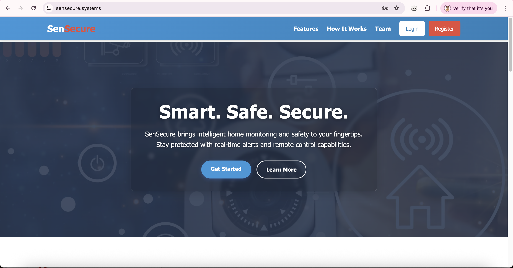
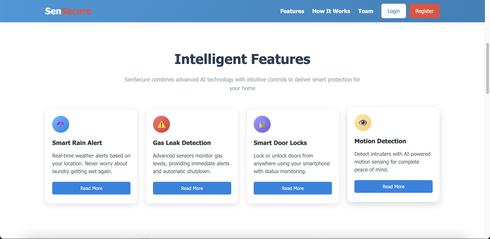
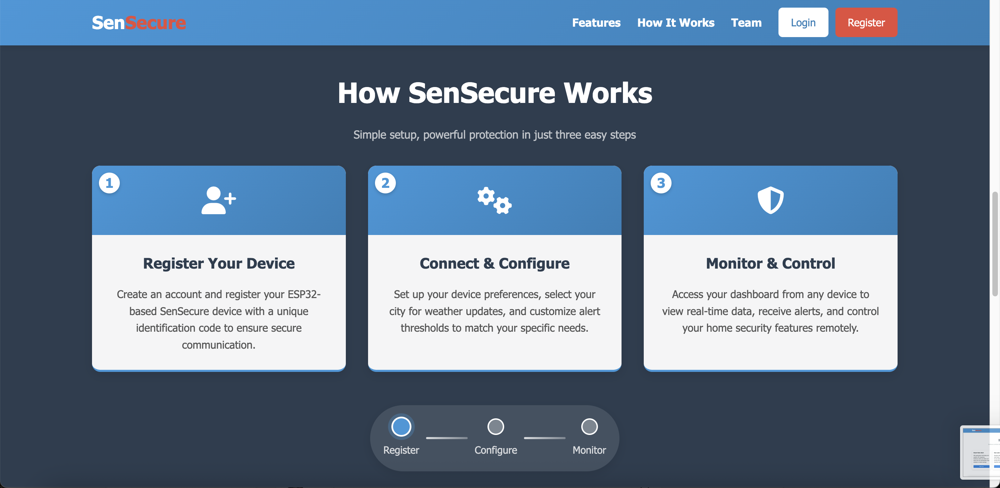
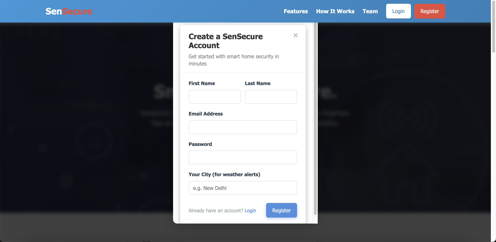
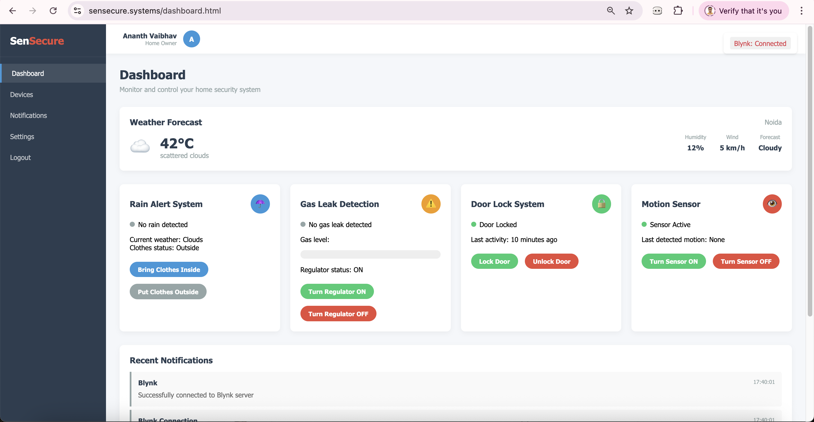
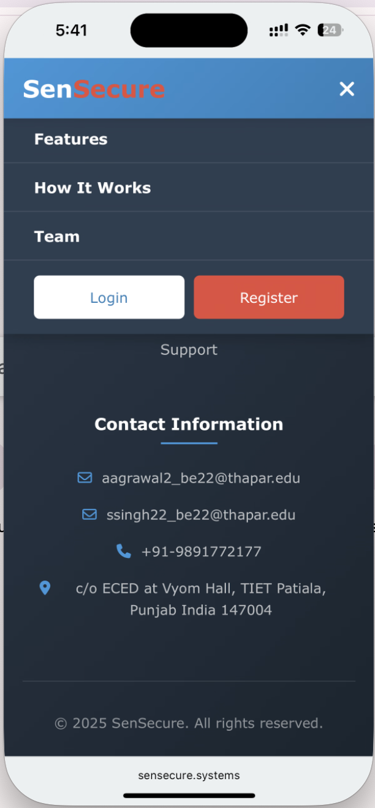
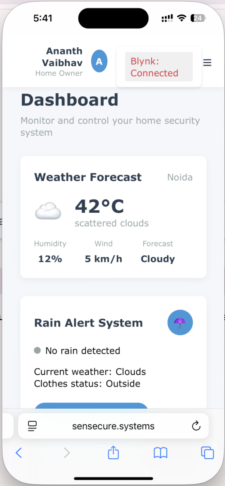
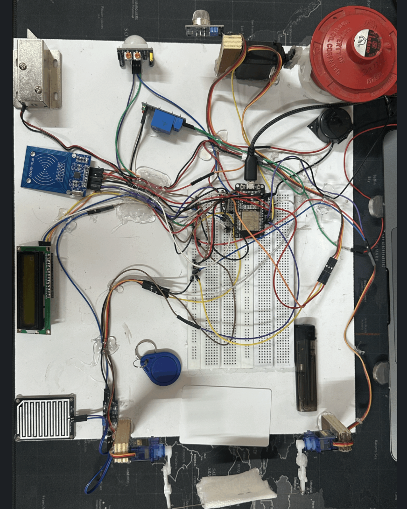

# SenSecure
💡 Smart IoT-based home security system with real-time alerts, gas leak detection, smart door locking, rain detection, and remote control via a custom web dashboard.
# SenSecure 🔐🌐

An IoT-powered, full-stack home security system integrating **motion detection**, **gas leak monitoring**, **smart rain alerts**, and **RFID access control**, all managed via a responsive **real-time web dashboard**.

🌍 Live Site: [www.sensecure.systems](http://www.sensecure.systems)

🌍 Demonstration Videos: https://drive.google.com/drive/folders/1hiyIC9jKv1s9RY0YgsLydAIuZf8EGA0q

## 💡 Overview

SenSecure is designed to make **homes safer, smarter, and more connected**. The system allows users to detect and respond to security or environmental threats with **remote control**, **real-time alerts**, and **automated actions**.

## 🚀 Features

- 🔒 **Smart Door Lock System** with RFID access and manual override
- 🔥 **Gas Leak Detection** with auto shut-off
- 🌧️ **Rain Detection** integrated with servo-controlled clothes mechanism
- 👁️ **Motion Sensing** with AI-based false trigger filtering
- 📊 **Real-Time Dashboard** (Built with Firebase + Blynk + OpenWeather API)
- 📱 Mobile and Web Access for control & alerts

## 🛠️ Tech Stack

### 🧠 Hardware
- ESP32
- MQ-6 Gas Sensor
- PIR Sensor
- Rain Sensor Pad
- RFID Module + Magnetic Lock
- Servo Motors
- LCD Display with I2C

### 💻 Software
- HTML, CSS, JavaScript
- Firebase Auth + Firestore
- Blynk IoT Platform
- OpenWeatherMap API
- MQTT Protocol

## 🧪 Use Cases
- Real-time home security monitoring
- Smart automation for environmental safety
- IoT dashboard development & cloud integration

## 🧑‍🤝‍🧑 Team

| Name                  | Role                              |
|-----------------------|-----------------------------------|
| **Ananth Vaibhav Agrawal** | Team Lead                         |
| Smarth Singh          | Security Expert & Hardware Lead  |
| Aryan Khanna          | Backend & Hardware Engineer      |
| Dhruv Sanmotra        | Systems Architect                |
| Hemant Kumar          | UI/UX Designer                   |

## 📷 Screenshots

### 🏠 Homepage  
Entry point for users with clear navigation and product overview.  

---

### ✨ Features Overview  
Clear listing of what SenSecure offers in terms of smart automation and safety.  

---

### 📊 System Architecture / Working  
How the SenSecure system integrates hardware, cloud, and UI.  

---

### 🔐 User Authentication  
Secure login and account management for user access control.  

---

### 🖥️ Web Dashboard  
Live control panel showing sensor statuses, alerts, and manual overrides.  

---

### 📱 Mobile View – Navigation  
Dropdown interface adapted for smaller screens.  

---

### 📱 Mobile View – Live Dashboard  
Mobile-friendly UI for full control on the go.  

### ⚙️ Hardware Setup  
ESP32, sensors, servo motors and real-time integration in action.  

## 🙏 Acknowledgments

- **Dr. Mohit Agarwal**, Associate Professor, ECED – Thapar Institute of Engineering and Technology, Patiala
- All mentors, classmates, and faculty who supported us.

## ⚠️ Disclaimer

Please do not use the Firebase and API keys present in the code without replacing them with your own credentials.

